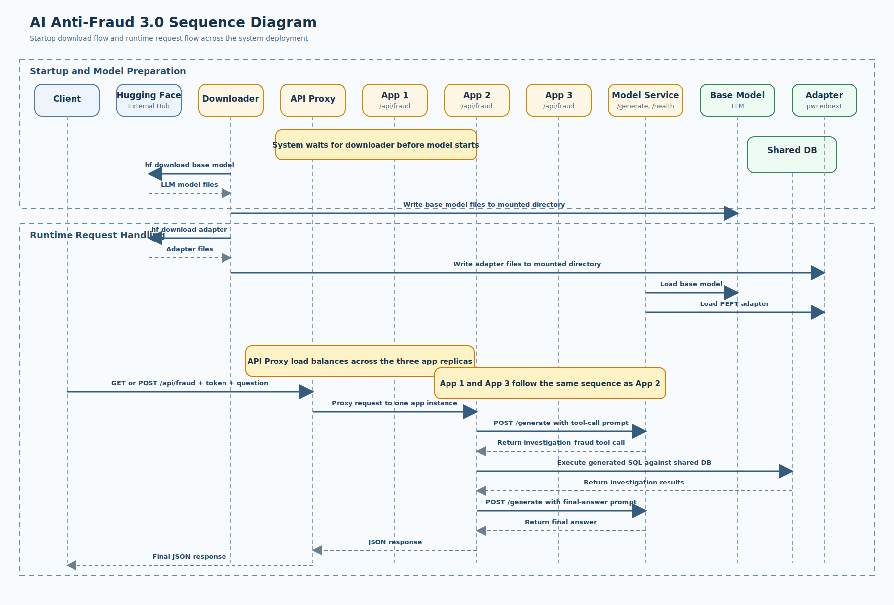
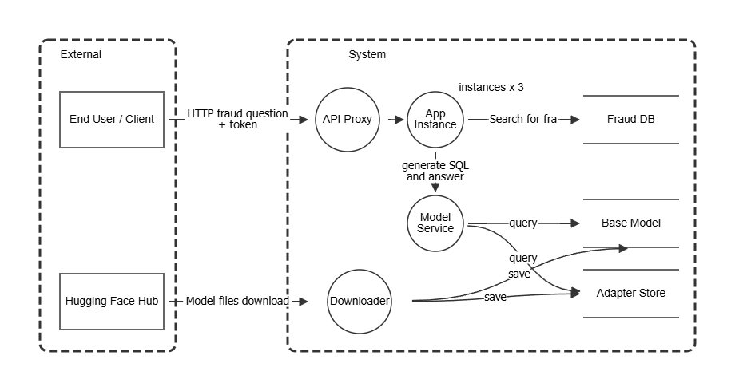

# PwnedNext - An OWASP Cornucopia Companion Guide

F-Corp Ltd just finished coding their brand new multitenanted AI application "AI Anti-Fraud 3.0" to be used by their customers in the Fintech space.
This has caught the interest of PwnedNext, a European company that sells solutions to a number of banks and financial institutions. They therefore have voiced their interest in buying F-Corp and their new AI system.

But under Article 9 of the AI Act, any AI system classified as "high-risk" mandates the implementation of a comprehensive risk management system throughout the entire lifecycle of the system. In order to identify foreseeable risks, PwnedNext is required to identify and analyze known and reasonably foreseeable AI risks. This includes examining what happens when the system faces adversarial attacks or is misused, forcing a practical threat modeling process. F-Corp must therefore prove that their system is designed and developed to be robust, secure, and adequately protected against unauthorized access, data poisoning, and manipulation.

The current CEO of F-Corp is panicking after becoming aware that they haven't done any threat modelling or risk assessment during the development of AI Anti-Fraud 3.0. Luckily, the CTO has heard about this game called OWASP Cornucopia that can be used to do threat modeling of AI applications quickly in order to satisfy PwnedNext's threat modeling and risk management requirements. He immediately urges all his junior AI developers and testers to come together for an OWASP Cornucopia session.

## High-Level Architecture of AI Anti-Fraud 3.0

The AI Anti-Fraud 3.0 is deployed as a small multi-container system using Docker Compose. It separates request handling, model inference, and supporting services so the application can be scaled and threat-modeled more easily.

### AI Anti-Fraud 3.0 Components

- `nginx`
  - Exposes `http://localhost:9000` on the host.
  - Acts as the public entry point for the system.
  - Reverse proxies requests to the `app` service and load balances across scaled app instances.

- `app`
  - Flask API service that exposes `/api/fraud`.
  - Accepts a fraud-investigation question from the user.
  - Sends chat messages to the model service to obtain a tool call and a final response.
  - Executes the generated SQL against the SQLite database.
  - Can be scaled horizontally, for example with `--scale app=3`.

- `model`
  - Separate Flask service that exposes `/generate` and `/health`.
  - Loads the Apertus base model together with the `pwnednext` adapter.
  - Performs inference for the app service.
  - Runs as a single shared inference backend for all app instances.

- `downloader`
  - One-shot setup container used during startup.
  - Downloads the base model and adapter from Hugging Face if they are not already present.
  - Writes those artifacts into shared mounted directories used by the model service.

### Data Stores

- Shared SQLite database
  - The app service uses a DB through `DB_CONNECTION_STRING=/data/db.sqlite`.
  - The database file is stored on the named Docker volume `app-db`.
  - All scaled app instances point to the same database file.

- Model artifact directories
  - `Apertus-8B-Instruct-2509/`
  - `pwnednext/`
  - These are mounted into the containers and used by the model service at runtime.

### Request Flow

1. A client sends a request to `http://localhost:9000/api/fraud`.
2. `nginx` receives the request and forwards it to one of the `app` instances.
3. The selected `app` instance validates the request and token.
4. The `app` service sends the prompt to the `model` service at `/generate`.
5. The `model` service returns a tool call or final text.
6. The `app` service executes the generated SQL against the shared SQLite database.
7. The `app` service sends the query results back to the `model` service for final answer generation.
8. The final JSON response is returned to the client through `nginx`.

### External Dependency

The system depends on Hugging Face as an external source for model artifacts. The `downloader` service fetches the base model and adapter before the inference service starts.

### Scaling Model

Only the `app` service is intended to scale out in normal usage:

- `nginx` remains the single public entry point.
- Multiple `app` instances handle incoming API traffic.
- A single `model` service performs inference for all app instances.
- All app instances share the same SQLite database volume.

## Setup

Running the demo.
You need a laptop with at least 32GB memory to run this. Make sure everything else is shut down.

### Windows

If you are on Windows, you need to edit your `.wslconfig` file.

    # Visual Studio Code
    code $env:USERPROFILE\.wslconfig

    # Add the following 
    [wsl2]
    memory=32GB
    processors=8
    swap=12GB

Then run:

    wsl --shutdown

Start Docker. Then...

    docker compose up --build

### Mac OS X

1. Docker Desktop -> Settings -> Resources
2. Memory: start with 24 GB (if you have 32 GB RAM total)
3. CPUs: 6 to 8
4. Swap: 8 to 12 GB
5. Apply and restart Docker Desktop

    docker compose up --build

## Scaling

The application is split into two services: the API (`app`) and the model inference service (`model`). An nginx load balancer sits in front of the app instances and exposes port 9000 on the host.

To run multiple app instances against a single model service:

    docker compose up --build --scale app=3

All traffic to `http://localhost:9000` is automatically round-robin distributed across the app instances by nginx.

## Why you should use this companion guide

If you have customers that need to comply with the AI Act or you have or want to have a certificate that proves you have a proper AI risk management system that covers controls that allow you to develop and test AI functionality in a responsible way, then you need to implement the appropriate Annex A controls according to the ISO 42001 standard.
The following controls are applicable in this regard:

- A.6.2 (Responsible AI Design and Development): Developers must be trained on how to apply ethical and safe design patterns. They need to understand principles like transparency, fairness, and safety boundaries during coding.
- A.6.3 (Verification and Validation): Testers and QA engineers must be trained in AI-specific testing methods. This includes evaluating model accuracy, checking for algorithmic drift, testing against adversarial attacks, and verifying 
- A.4.2 (Human Resources) mandates that organizations must ensure they have access to adequate human resources with the necessary AI expertise to develop systems safely. Training programs for internal developers and testers are standard evidence used to fulfill this control.

Through gamification, this game master guide introduces developers and testers to threats, risks, and requirements related to AI design and development and teaches them how to mitigate these risks. The game scenario takes the participants through a provocative scenario where they have to identify AI threats by studying an insecure AI implementation. They need to ask themselves "what can go wrong" and "what are they (we) going to do about it"? Furthermore, by playing, they will get to know which tests from the OWASP AI Test Guide (AITG) and OWASP AI Security Verification Standard (AISVS) need to be considered in order to responsibly develop AI applications.
They will also become familiar with AI attack techniques from MITRE ATLAS and AI risks according to OWASP Top 10 for LLM and OWASP Top 10 for Agentic AI.

## ISO 42001

ISO 42001 operates as a broad, risk-based management framework that requires organizations to identify AI risks and ensure that all staff have the necessary competencies to execute their roles safely.
Instead of dictating a rigid training syllabus, the standard embeds learning and competence into its high-level clauses

- Clause 7.2 (Competence): Requires your organization to determine the necessary competence of all people doing work under its control that affects your AI performance and safety.
- Clause 7.3 (Awareness): Mandates that personnel are aware of the AI policy, their contribution to the effectiveness of the AI Management System (AIMS), and the implications of not conforming with AIMS requirements.

## Annex A Controls

ISO includes 38 optional risk management controls covering the AI lifecycle. If an organization's risk assessment identifies that an unskilled developer or tester poses a threat to AI safety (e.g., data poisoning, bias introduction), the organization must design and implement the appropriate training "control" to mitigate that specific risk.

## What this Training Covers

Because ISO 42001 ensures transparency, fairness, and accountability in AI, training for developers and testers typically encompasses:

- AI Literacy and Concepts: Understanding how the AI models function, their limitations, and intended applications.
- AI Risk Management: Learning how to spot vulnerabilities and biases within models.
- Data Quality Management: Ensuring that training and testing data are secure, unbiased, and compliant with privacy regulations.
- Ethical AI Principles: Prioritizing human oversight, safety, and non-discrimination during the design and testing phases.

This training is made specifically to cover these needs.

## Disclaimer

ISO/IEC 42001 is an external referenced standard and is not included in this repository or covered by the repository's license. Any references in this repository to ISO/IEC 42001, its clauses, or Annex A controls are provided for informational and educational purposes only.

This training material does not, by itself, make an organization ISO/IEC 42001 compliant and should not be treated as certification, legal advice, or a complete implementation guide. At most, it may serve as a small supporting aid when considering and implementing some of the Annex A controls referenced in this README.

## Other things

### Tuning

It's possible to tune the model. The tuning functionality could be a great start for talking about supply chain attacks, but it needs to be extended.

python -X utf8 .\tune.py

You may get the following message: 'pin_memory' argument is set as true but no accelerator is found, then device pinned memory won't be used.

This warning will not break your LLM training, but it can lead to minor efficiency issues or performance degradation.

In PyTorch, pin_memory=True is designed to speed up data transfers between the CPU (host) and GPU (accelerator) by using "page-locked" memory. When no accelerator is found, the training defaults to your CPU, making the memory-pinning step unnecessary.

## Upload the model

There is a script to upload the model, but you need to install all the python dependencies from requirements.txt first.